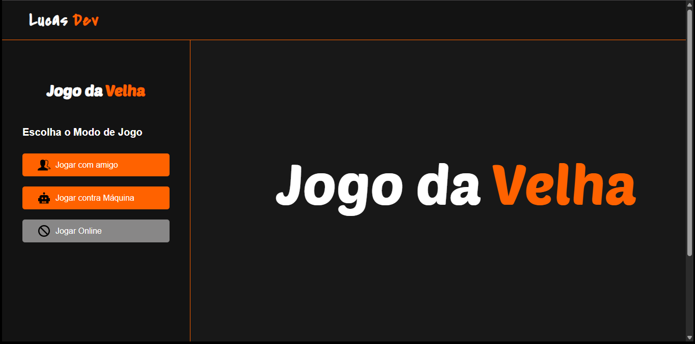

# 🎮 Jogo da Velha (Tic Tac Toe)

Um simples e divertido jogo da velha desenvolvido com HTML, CSS e JavaScript. Você pode jogar contra um amigo ou contra a máquina!  
O projeto também possui placar de pontuação, reinício de partidas, e uma interface amigável.

## 📸 Preview

 

---

## 🧠 Funcionalidades

- 🎮 Modo de jogo:
  - Player vs Player
  - Player vs Máquina (bot)
- 🧠 Bot com jogadas inteligentes (tentativas de vencer ou bloquear o jogador)
- 🔁 Reinício da partida sem resetar a pontuação
- 🏆 Placar em tempo real
- 💡 Mensagens indicando vitória, empate ou vez do jogador
- 🔁 Alternância de turno
- 🧪 Detecção de vitória com padrões
- 👨‍💻 Interface responsiva

---

## 🚀 Como usar

1. Clone o repositório:
   ```bash
   git clone https://github.com/seu-usuario/jogo-da-velha.git
   cd jogo-da-velha
